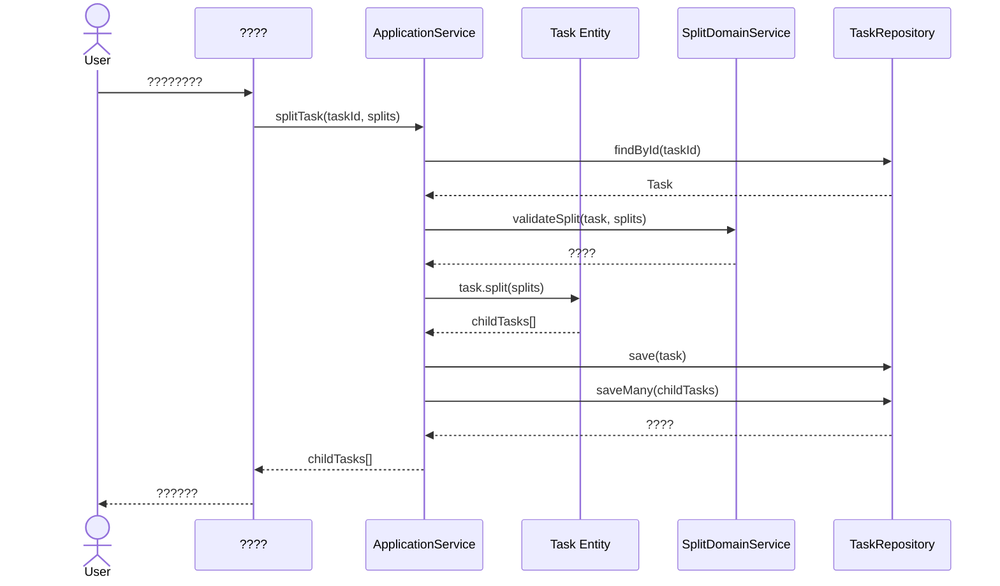
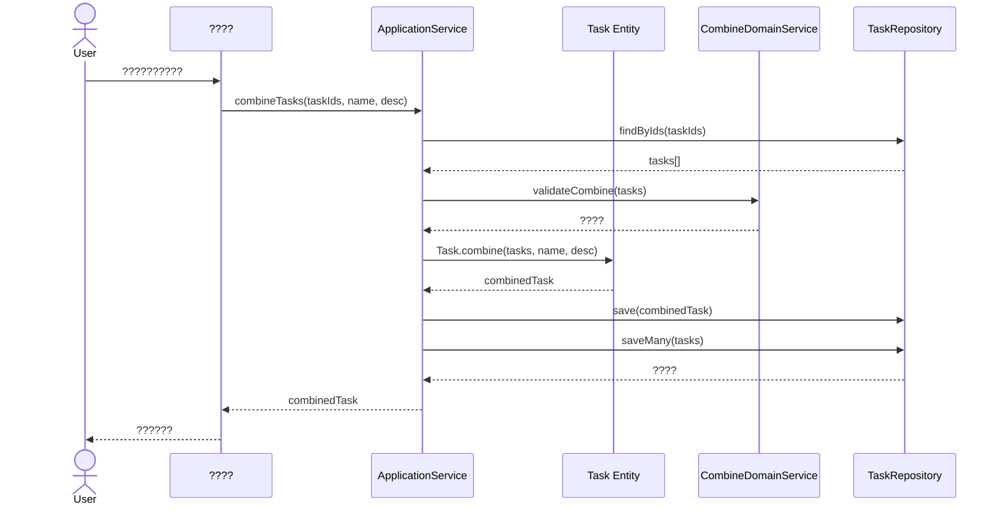

# ???????????DDD + Angular v20?

## ?? ??

1. [????](#????)
2. [DDD ??????](#ddd-??????)
3. [Angular v20 ????](#angular-v20-????)
4. [API ??](#api-??)
5. [????](#????)
6. [????](#????)
7. [???????](#???????)

---

## ????

### ????

#### 1. ?????????
- ?????????????
- ????????
- ??????????

#### 2. ?????????
- ??????????????
- ???????
- ????????

### ????
- ? ????????
- ? ?????????????
- ? ????
- ? ?????????

---

## DDD ??????

### ????

```
?????? (Task Management System)
?
??? ???? (Task Domain) - ????
?   ??? ???? (Task Aggregate)
?   ??? ???????? (TaskSplitDomainService)
?   ??? ???????? (TaskCombineDomainService)
?
??? ???? (Allocation Domain) - ????
?   ??? ?????? (RewardAllocationStrategy)
?
??? ???? (Shared Kernel)
    ??? ????? (Money)
    ??? ???? (TaskStatus)
```

### 1. ????????

#### 1.1 Task???????

```typescript
// domain/entities/task.entity.ts

export enum TaskStatus {
  DRAFT = 'DRAFT',                    // ??
  PENDING = 'PENDING',                // ???
  IN_PROGRESS = 'IN_PROGRESS',        // ???
  COMPLETED = 'COMPLETED',            // ???
  CANCELLED = 'CANCELLED',            // ???
  SPLIT = 'SPLIT',                    // ???
  COMBINED = 'COMBINED'               // ???
}

export enum TaskType {
  ORIGINAL = 'ORIGINAL',              // ????
  SPLIT_PARENT = 'SPLIT_PARENT',      // ?????
  SPLIT_CHILD = 'SPLIT_CHILD',        // ?????
  COMBINED_PARENT = 'COMBINED_PARENT', // ?????
  COMBINED_CHILD = 'COMBINED_CHILD'   // ?????
}

export class Task {
  private constructor(
    private readonly _id: TaskId,
    private _name: string,
    private _description: string,
    private _reward: Money,
    private _status: TaskStatus,
    private _type: TaskType,
    private _parentTaskId?: TaskId,
    private _childTaskIds: TaskId[] = [],
    private _assignee?: string,
    private _createdAt: Date = new Date(),
    private _updatedAt: Date = new Date()
  ) {}

  // ???????????
  static create(
    name: string,
    description: string,
    reward: Money
  ): Task {
    return new Task(
      TaskId.generate(),
      name,
      description,
      reward,
      TaskStatus.DRAFT,
      TaskType.ORIGINAL
    );
  }

  // ?????????
  split(splits: TaskSplitInfo[]): Task[] {
    this.validateCanSplit();
    this.validateSplitAmounts(splits);

    const childTasks = splits.map(split => 
      new Task(
        TaskId.generate(),
        split.name,
        split.description || `${this._name} - ???`,
        split.reward,
        TaskStatus.PENDING,
        TaskType.SPLIT_CHILD,
        this._id,
        [],
        split.assignee
      )
    );

    // ??????
    this._status = TaskStatus.SPLIT;
    this._type = TaskType.SPLIT_PARENT;
    this._childTaskIds = childTasks.map(t => t.id);
    this._updatedAt = new Date();

    return childTasks;
  }

  // ?????????
  cancelSplit(): void {
    if (this._type !== TaskType.SPLIT_PARENT) {
      throw new DomainException('?????????????');
    }

    if (this._status !== TaskStatus.SPLIT) {
      throw new DomainException('???????????');
    }

    // ????????????
    // ?????????????

    this._status = TaskStatus.DRAFT;
    this._type = TaskType.ORIGINAL;
    this._childTaskIds = [];
    this._updatedAt = new Date();
  }

  // ???????????????
  static combine(
    tasks: Task[],
    name: string,
    description: string
  ): Task {
    Task.validateCanCombine(tasks);

    const totalReward = tasks.reduce(
      (sum, task) => sum.add(task.reward),
      Money.zero()
    );

    const combinedTask = new Task(
      TaskId.generate(),
      name,
      description,
      totalReward,
      TaskStatus.PENDING,
      TaskType.COMBINED_PARENT,
      undefined,
      tasks.map(t => t.id)
    );

    // ???????
    tasks.forEach(task => {
      task._status = TaskStatus.COMBINED;
      task._type = TaskType.COMBINED_CHILD;
      task._parentTaskId = combinedTask.id;
      task._updatedAt = new Date();
    });

    return combinedTask;
  }

  // ?????????
  start(): void {
    if (this._status !== TaskStatus.PENDING) {
      throw new DomainException('??????????????');
    }

    this._status = TaskStatus.IN_PROGRESS;
    this._updatedAt = new Date();
  }

  // ?????????
  complete(): void {
    if (this._status !== TaskStatus.IN_PROGRESS) {
      throw new DomainException('????????????');
    }

    this._status = TaskStatus.COMPLETED;
    this._updatedAt = new Date();
  }

  // ????
  private validateCanSplit(): void {
    if (this._status === TaskStatus.IN_PROGRESS) {
      throw new DomainException('??????????');
    }

    if (this._status === TaskStatus.COMPLETED) {
      throw new DomainException('??????????');
    }

    if (this._type === TaskType.SPLIT_CHILD || this._type === TaskType.COMBINED_CHILD) {
      throw new DomainException('????????');
    }
  }

  private validateSplitAmounts(splits: TaskSplitInfo[]): void {
    const totalSplitAmount = splits.reduce(
      (sum, split) => sum.add(split.reward),
      Money.zero()
    );

    if (!totalSplitAmount.equals(this._reward)) {
      throw new DomainException(
        `?????? ${totalSplitAmount.amount} ????????? ${this._reward.amount}`
      );
    }
  }

  private static validateCanCombine(tasks: Task[]): void {
    if (tasks.length < 2) {
      throw new DomainException('???? 2 ???????');
    }

    tasks.forEach(task => {
      if (task.status === TaskStatus.IN_PROGRESS) {
        throw new DomainException('??????????');
      }

      if (task.status === TaskStatus.COMPLETED) {
        throw new DomainException('??????????');
      }

      if (task.type === TaskType.SPLIT_CHILD || task.type === TaskType.COMBINED_CHILD) {
        throw new DomainException('???????');
      }
    });
  }

  // Getters
  get id(): TaskId { return this._id; }
  get name(): string { return this._name; }
  get reward(): Money { return this._reward; }
  get status(): TaskStatus { return this._status; }
  get type(): TaskType { return this._type; }
  get childTaskIds(): TaskId[] { return [...this._childTaskIds]; }
  get parentTaskId(): TaskId | undefined { return this._parentTaskId; }
}
```

#### 1.2 TaskId??? ID ????

```typescript
// domain/value-objects/task-id.vo.ts

export class TaskId {
  private readonly value: string;

  private constructor(value: string) {
    if (!value || value.trim().length === 0) {
      throw new DomainException('?? ID ????');
    }
    this.value = value;
  }

  static create(value: string): TaskId {
    return new TaskId(value);
  }

  static generate(): TaskId {
    // ?? UUID ????????????
    return new TaskId(crypto.randomUUID());
  }

  equals(other: TaskId): boolean {
    return this.value === other.value;
  }

  toString(): string {
    return this.value;
  }
}
```

#### 1.3 Money???????

```typescript
// domain/value-objects/money.vo.ts

export class Money {
  private readonly amount: number;
  private readonly currency: string;

  private constructor(amount: number, currency: string = 'TWD') {
    if (amount < 0) {
      throw new DomainException('???????');
    }
    this.amount = amount;
    this.currency = currency;
  }

  static create(amount: number, currency: string = 'TWD'): Money {
    return new Money(amount, currency);
  }

  static zero(): Money {
    return new Money(0);
  }

  add(other: Money): Money {
    this.ensureSameCurrency(other);
    return new Money(this.amount + other.amount, this.currency);
  }

  subtract(other: Money): Money {
    this.ensureSameCurrency(other);
    return new Money(this.amount - other.amount, this.currency);
  }

  multiply(multiplier: number): Money {
    return new Money(this.amount * multiplier, this.currency);
  }

  divide(divisor: number): Money {
    if (divisor === 0) {
      throw new DomainException('????? 0');
    }
    return new Money(this.amount / divisor, this.currency);
  }

  equals(other: Money): boolean {
    return this.amount === other.amount && this.currency === other.currency;
  }

  private ensureSameCurrency(other: Money): void {
    if (this.currency !== other.currency) {
      throw new DomainException('????????');
    }
  }

  getAmount(): number {
    return this.amount;
  }

  getCurrency(): string {
    return this.currency;
  }

  toString(): string {
    return `${this.currency} ${this.amount.toLocaleString()}`;
  }
}
```

#### 1.4 TaskSplitInfo????????

```typescript
// domain/value-objects/task-split-info.vo.ts

export class TaskSplitInfo {
  constructor(
    public readonly name: string,
    public readonly reward: Money,
    public readonly assignee?: string,
    public readonly description?: string
  ) {
    if (!name || name.trim().length === 0) {
      throw new DomainException('?????????');
    }
  }
}
```

### 2. ????

#### 2.1 TaskSplitDomainService??????????

```typescript
// domain/services/task-split-domain.service.ts

export class TaskSplitDomainService {
  /**
   * ??????
   */
  validateSplit(task: Task, splits: TaskSplitInfo[]): void {
    // ??????
    if (!this.canSplit(task)) {
      throw new DomainException('??????????');
    }

    // ??????
    if (splits.length < 2) {
      throw new DomainException('??????? 2 ????');
    }

    // ??????
    const totalAmount = splits.reduce(
      (sum, split) => sum.add(split.reward),
      Money.zero()
    );

    if (!totalAmount.equals(task.reward)) {
      throw new DomainException(
        `?????? ${totalAmount.toString()} ????????? ${task.reward.toString()}`
      );
    }
  }

  /**
   * ??????????
   */
  canSplit(task: Task): boolean {
    return ![
      TaskStatus.IN_PROGRESS,
      TaskStatus.COMPLETED,
      TaskStatus.CANCELLED
    ].includes(task.status);
  }

  /**
   * ??????????
   */
  canCancelSplit(parentTask: Task, childTasks: Task[]): boolean {
    // ??????????
    if (parentTask.type !== TaskType.SPLIT_PARENT) {
      return false;
    }

    // ????????????????
    return childTasks.every(child => 
      child.status !== TaskStatus.IN_PROGRESS && 
      child.status !== TaskStatus.COMPLETED
    );
  }

  /**
   * ???????????
   */
  generateEvenSplits(
    task: Task,
    assignees: string[]
  ): TaskSplitInfo[] {
    const splitCount = assignees.length;
    const averageAmount = task.reward.divide(splitCount);
    
    return assignees.map((assignee, index) => 
      new TaskSplitInfo(
        `${task.name} - ??? ${index + 1}`,
        averageAmount,
        assignee
      )
    );
  }
}
```

#### 2.2 TaskCombineDomainService??????????

```typescript
// domain/services/task-combine-domain.service.ts

export class TaskCombineDomainService {
  /**
   * ??????
   */
  validateCombine(tasks: Task[]): void {
    // ??????
    if (tasks.length < 2) {
      throw new DomainException('???? 2 ???????');
    }

    // ?????????
    tasks.forEach(task => {
      if (!this.canCombine(task)) {
        throw new DomainException(`?? ${task.name} ????`);
      }
    });

    // ?????????
    const uniqueIds = new Set(tasks.map(t => t.id.toString()));
    if (uniqueIds.size !== tasks.length) {
      throw new DomainException('?????????');
    }
  }

  /**
   * ??????????
   */
  canCombine(task: Task): boolean {
    // ?????????????
    if ([TaskStatus.IN_PROGRESS, TaskStatus.COMPLETED].includes(task.status)) {
      return false;
    }

    // ??????
    if ([TaskType.SPLIT_CHILD, TaskType.COMBINED_CHILD].includes(task.type)) {
      return false;
    }

    return true;
  }

  /**
   * ?????????
   */
  calculateTotalReward(tasks: Task[]): Money {
    return tasks.reduce(
      (sum, task) => sum.add(task.reward),
      Money.zero()
    );
  }

  /**
   * ??????????
   */
  canCancelCombine(combinedTask: Task, childTasks: Task[]): boolean {
    // ????????????
    if (combinedTask.type !== TaskType.COMBINED_PARENT) {
      return false;
    }

    // ????????????
    if (combinedTask.status === TaskStatus.IN_PROGRESS) {
      return false;
    }

    return true;
  }
}
```

### 3. ????

```typescript
// domain/events/task-domain-events.ts

export abstract class DomainEvent {
  public readonly occurredOn: Date;

  constructor() {
    this.occurredOn = new Date();
  }
}

// ???????
export class TaskSplittedEvent extends DomainEvent {
  constructor(
    public readonly parentTaskId: TaskId,
    public readonly childTaskIds: TaskId[],
    public readonly totalReward: Money
  ) {
    super();
  }
}

// ???????
export class TaskCombinedEvent extends DomainEvent {
  constructor(
    public readonly combinedTaskId: TaskId,
    public readonly sourceTaskIds: TaskId[],
    public readonly totalReward: Money
  ) {
    super();
  }
}

// ???????
export class SplitCancelledEvent extends DomainEvent {
  constructor(
    public readonly parentTaskId: TaskId,
    public readonly cancelledChildTaskIds: TaskId[]
  ) {
    super();
  }
}

// ????????
export class TaskStatusChangedEvent extends DomainEvent {
  constructor(
    public readonly taskId: TaskId,
    public readonly oldStatus: TaskStatus,
    public readonly newStatus: TaskStatus
  ) {
    super();
  }
}
```

### 4. ????

```typescript
// domain/repositories/task.repository.interface.ts

export interface ITaskRepository {
  // ?? CRUD
  findById(id: TaskId): Promise<Task | null>;
  findByIds(ids: TaskId[]): Promise<Task[]>;
  save(task: Task): Promise<void>;
  saveMany(tasks: Task[]): Promise<void>;
  delete(id: TaskId): Promise<void>;

  // ????
  findAll(): Promise<Task[]>;
  findByStatus(status: TaskStatus): Promise<Task[]>;
  findByType(type: TaskType): Promise<Task[]>;
  findChildTasks(parentId: TaskId): Promise<Task[]>;
  findByParentId(parentId: TaskId): Promise<Task[]>;
  
  // ????
  countByStatus(status: TaskStatus): Promise<number>;
  getTotalRewardByStatus(status: TaskStatus): Promise<Money>;
}
```

---

## Angular v20 ????

### ??????

```
src/
??? app/
?   ??? core/                          # ??????????
?   ?   ??? services/                  # ????
?   ?   ??? guards/                    # ????
?   ?   ??? interceptors/              # HTTP ???
?   ?   ??? core.module.ts
?   ?
?   ??? shared/                        # ???????????
?   ?   ??? components/                # ????
?   ?   ??? directives/                # ????
?   ?   ??? pipes/                     # ????
?   ?   ??? shared.module.ts
?   ?
?   ??? features/                      # ????
?   ?   ??? task-management/           # ??????
?   ?   ?   ??? components/
?   ?   ?   ?   ??? task-list/
?   ?   ?   ?   ??? task-detail/
?   ?   ?   ?   ??? task-split/
?   ?   ?   ?   ??? task-combine/
?   ?   ?   ??? services/
?   ?   ?   ?   ??? task-application.service.ts
?   ?   ?   ?   ??? task-state.service.ts
?   ?   ?   ??? models/
?   ?   ?   ??? task-management.routes.ts
?   ?   ?
?   ?   ??? dashboard/                 # ???
?   ?
?   ??? domain/                        # DDD ?????????
?   ?   ??? entities/
?   ?   ??? value-objects/
?   ?   ??? services/
?   ?   ??? events/
?   ?
?   ??? infrastructure/                # ?????
?   ?   ??? api/                       # API ??
?   ?   ??? repositories/              # ????
?   ?   ??? state/                     # ????
?   ?
?   ??? app.config.ts                  # ?????Angular 20?
?
??? environments/                      # ????
```

### 1. ??????

#### 1.1 ??????

```typescript
// features/task-management/components/task-list/task-list.component.ts

import { Component, OnInit, signal, computed } from '@angular/core';
import { CommonModule } from '@angular/common';
import { TaskApplicationService } from '../../services/task-application.service';
import { TaskStateService } from '../../services/task-state.service';
import { Task, TaskStatus, TaskType } from '../../../../domain/entities/task.entity';

@Component({
  selector: 'app-task-list',
  standalone: true,
  imports: [CommonModule],
  templateUrl: './task-list.component.html',
  styleUrls: ['./task-list.component.scss']
})
export class TaskListComponent implements OnInit {
  // Signals?Angular 20 ??????
  tasks = signal<Task[]>([]);
  selectedTasks = signal<Set<string>>(new Set());
  filterStatus = signal<TaskStatus | 'ALL'>('ALL');
  
  // Computed signals
  filteredTasks = computed(() => {
    const status = this.filterStatus();
    if (status === 'ALL') {
      return this.tasks();
    }
    return this.tasks().filter(task => task.status === status);
  });

  canCombine = computed(() => {
    return this.selectedTasks().size >= 2;
  });

  constructor(
    private taskService: TaskApplicationService,
    private taskState: TaskStateService
  ) {}

  ngOnInit(): void {
    this.loadTasks();
  }

  async loadTasks(): Promise<void> {
    const tasks = await this.taskService.getAllTasks();
    this.tasks.set(tasks);
  }

  toggleTaskSelection(taskId: string): void {
    const selected = new Set(this.selectedTasks());
    if (selected.has(taskId)) {
      selected.delete(taskId);
    } else {
      selected.add(taskId);
    }
    this.selectedTasks.set(selected);
  }

  async onSplitTask(task: Task): Promise<void> {
    // ???????????????
  }

  async onCombineTasks(): Promise<void> {
    // ???????????????
  }

  getStatusLabel(status: TaskStatus): string {
    const labels: Record<TaskStatus, string> = {
      [TaskStatus.DRAFT]: '??',
      [TaskStatus.PENDING]: '???',
      [TaskStatus.IN_PROGRESS]: '???',
      [TaskStatus.COMPLETED]: '???',
      [TaskStatus.CANCELLED]: '???',
      [TaskStatus.SPLIT]: '???',
      [TaskStatus.COMBINED]: '???'
    };
    return labels[status];
  }

  getTypeLabel(type: TaskType): string {
    const labels: Record<TaskType, string> = {
      [TaskType.ORIGINAL]: '????',
      [TaskType.SPLIT_PARENT]: '?????',
      [TaskType.SPLIT_CHILD]: '?????',
      [TaskType.COMBINED_PARENT]: '?????',
      [TaskType.COMBINED_CHILD]: '?????'
    };
    return labels[type];
  }
}
```

```html
<!-- features/task-management/components/task-list/task-list.component.html -->

<div class="task-list-container">
  <div class="header">
    <h2>????</h2>
    <div class="actions">
      <button 
        class="btn btn-primary"
        [disabled]="!canCombine()"
        (click)="onCombineTasks()">
        ???? ({{ selectedTasks().size }})
      </button>
    </div>
  </div>

  <div class="filters">
    <label>?????</label>
    <select [(ngModel)]="filterStatus" (change)="filterStatus.set($any($event.target).value)">
      <option value="ALL">??</option>
      <option [value]="TaskStatus.DRAFT">??</option>
      <option [value]="TaskStatus.PENDING">???</option>
      <option [value]="TaskStatus.IN_PROGRESS">???</option>
      <option [value]="TaskStatus.COMPLETED">???</option>
    </select>
  </div>

  <div class="task-grid">
    @for (task of filteredTasks(); track task.id.toString()) {
      <div class="task-card" [class.selected]="selectedTasks().has(task.id.toString())">
        <div class="task-header">
          <input 
            type="checkbox"
            [checked]="selectedTasks().has(task.id.toString())"
            (change)="toggleTaskSelection(task.id.toString())">
          <h3>{{ task.name }}</h3>
          <span class="task-type">{{ getTypeLabel(task.type) }}</span>
        </div>

        <div class="task-body">
          <p>{{ task.description }}</p>
          <div class="task-meta">
            <span class="reward">???{{ task.reward.toString() }}</span>
            <span class="status" [attr.data-status]="task.status">
              {{ getStatusLabel(task.status) }}
            </span>
          </div>
        </div>

        <div class="task-footer">
          @if (task.type === TaskType.ORIGINAL || task.type === TaskType.SPLIT_PARENT) {
            <button 
              class="btn btn-secondary"
              (click)="onSplitTask(task)"
              [disabled]="task.status === TaskStatus.IN_PROGRESS || task.status === TaskStatus.COMPLETED">
              ????
            </button>
          }
          
          @if (task.childTaskIds.length > 0) {
            <span class="child-count">????{{ task.childTaskIds.length }}</span>
          }
        </div>
      </div>
    }
  </div>
</div>
```

#### 1.2 ??????

```typescript
// features/task-management/components/task-split/task-split.component.ts

import { Component, OnInit, signal, computed } from '@angular/core';
import { CommonModule } from '@angular/common';
import { FormsModule } from '@angular/forms';
import { ActivatedRoute, Router } from '@angular/router';
import { TaskApplicationService } from '../../services/task-application.service';
import { Task } from '../../../../domain/entities/task.entity';
import { Money } from '../../../../domain/value-objects/money.vo';
import { TaskSplitInfo } from '../../../../domain/value-objects/task-split-info.vo';

interface SplitForm {
  name: string;
  reward: number;
  assignee: string;
  description: string;
}

@Component({
  selector: 'app-task-split',
  standalone: true,
  imports: [CommonModule, FormsModule],
  templateUrl: './task-split.component.html',
  styleUrls: ['./task-split.component.scss']
})
export class TaskSplitComponent implements OnInit {
  task = signal<Task | null>(null);
  splits = signal<SplitForm[]>([
    { name: '', reward: 0, assignee: '', description: '' }
  ]);

  // Computed values
  totalSplitAmount = computed(() => {
    return this.splits().reduce((sum, split) => sum + split.reward, 0);
  });

  remainingAmount = computed(() => {
    const task = this.task();
    if (!task) return 0;
    return task.reward.getAmount() - this.totalSplitAmount();
  });

  isValid = computed(() => {
    const task = this.task();
    if (!task) return false;

    // ???? 2 ???
    if (this.splits().length < 2) return false;

    // ????????????
    const allValid = this.splits().every(split => 
      split.name.trim() !== '' && split.reward > 0
    );

    // ???????????
    const amountMatch = this.totalSplitAmount() === task.reward.getAmount();

    return allValid && amountMatch;
  });

  constructor(
    private route: ActivatedRoute,
    private router: Router,
    private taskService: TaskApplicationService
  ) {}

  async ngOnInit(): Promise<void> {
    const taskId = this.route.snapshot.paramMap.get('id');
    if (taskId) {
      const task = await this.taskService.getTask(taskId);
      this.task.set(task);
    }
  }

  addSplit(): void {
    this.splits.update(current => [
      ...current,
      { name: '', reward: 0, assignee: '', description: '' }
    ]);
  }

  removeSplit(index: number): void {
    if (this.splits().length > 1) {
      this.splits.update(current => 
        current.filter((_, i) => i !== index)
      );
    }
  }

  autoDistribute(): void {
    const task = this.task();
    if (!task) return;

    const count = this.splits().length;
    const averageAmount = Math.floor(task.reward.getAmount() / count);
    const remainder = task.reward.getAmount() % count;

    this.splits.update(current => 
      current.map((split, index) => ({
        ...split,
        reward: averageAmount + (index === 0 ? remainder : 0)
      }))
    );
  }

  async onSubmit(): Promise<void> {
    const task = this.task();
    if (!task || !this.isValid()) return;

    try {
      const splitInfos = this.splits().map(split =>
        new TaskSplitInfo(
          split.name,
          Money.create(split.reward),
          split.assignee || undefined,
          split.description || undefined
        )
      );

      await this.taskService.splitTask(task.id.toString(), splitInfos);
      this.router.navigate(['/tasks']);
    } catch (error) {
      console.error('?????', error);
      // ??????
    }
  }

  onCancel(): void {
    this.router.navigate(['/tasks']);
  }
}
```

```html
<!-- features/task-management/components/task-split/task-split.component.html -->

<div class="task-split-container">
  @if (task(); as currentTask) {
    <div class="header">
      <h2>?????{{ currentTask.name }}</h2>
      <div class="original-info">
        <span>????{{ currentTask.reward.toString() }}</span>
        <span [class.warning]="remainingAmount() !== 0">
          ???{{ remainingAmount().toLocaleString() }}
        </span>
      </div>
    </div>

    <div class="split-form">
      <div class="form-actions">
        <button class="btn btn-secondary" (click)="addSplit()">
          ? ????
        </button>
        <button class="btn btn-secondary" (click)="autoDistribute()">
          ?? ????
        </button>
      </div>

      @for (split of splits(); track $index) {
        <div class="split-item">
          <div class="split-header">
            <h4>??? {{ $index + 1 }}</h4>
            @if (splits().length > 1) {
              <button 
                class="btn-icon"
                (click)="removeSplit($index)">
                ?
              </button>
            }
          </div>

          <div class="form-group">
            <label>?? *</label>
            <input 
              type="text"
              [(ngModel)]="split.name"
              placeholder="???????"
              required>
          </div>

          <div class="form-group">
            <label>?? *</label>
            <input 
              type="number"
              [(ngModel)]="split.reward"
              placeholder="??????"
              min="0"
              required>
          </div>

          <div class="form-group">
            <label>???</label>
            <input 
              type="text"
              [(ngModel)]="split.assignee"
              placeholder="?????">
          </div>

          <div class="form-group">
            <label>??</label>
            <textarea 
              [(ngModel)]="split.description"
              placeholder="??????"
              rows="3"></textarea>
          </div>
        </div>
      }
    </div>

    <div class="footer">
      <div class="summary">
        <span>?????{{ splits().length }}</span>
        <span>????{{ totalSplitAmount().toLocaleString() }}</span>
        <span [class.error]="!isValid()">
          @if (isValid()) {
            ? ????
          } @else {
            ? ??????????
          }
        </span>
      </div>

      <div class="actions">
        <button class="btn btn-secondary" (click)="onCancel()">
          ??
        </button>
        <button 
          class="btn btn-primary"
          [disabled]="!isValid()"
          (click)="onSubmit()">
          ????
        </button>
      </div>
    </div>
  }
</div>
```

#### 1.3 ??????

```typescript
// features/task-management/components/task-combine/task-combine.component.ts

import { Component, OnInit, signal, computed } from '@angular/core';
import { CommonModule } from '@angular/common';
import { FormsModule } from '@angular/forms';
import { Router } from '@angular/router';
import { TaskApplicationService } from '../../services/task-application.service';
import { Task } from '../../../../domain/entities/task.entity';
import { Money } from '../../../../domain/value-objects/money.vo';

@Component({
  selector: 'app-task-combine',
  standalone: true,
  imports: [CommonModule, FormsModule],
  templateUrl: './task-combine.component.html',
  styleUrls: ['./task-combine.component.scss']
})
export class TaskCombineComponent implements OnInit {
  availableTasks = signal<Task[]>([]);
  selectedTaskIds = signal<Set<string>>(new Set());
  combinedName = signal('');
  combinedDescription = signal('');

  // Computed values
  selectedTasks = computed(() => {
    const ids = this.selectedTaskIds();
    return this.availableTasks().filter(task => 
      ids.has(task.id.toString())
    );
  });

  totalReward = computed(() => {
    return this.selectedTasks().reduce(
      (sum, task) => sum.add(task.reward),
      Money.zero()
    );
  });

  canCombine = computed(() => {
    return this.selectedTaskIds().size >= 2 && 
           this.combinedName().trim() !== '';
  });

  constructor(
    private router: Router,
    private taskService: TaskApplicationService
  ) {}

  async ngOnInit(): Promise<void> {
    await this.loadAvailableTasks();
  }

  async loadAvailableTasks(): Promise<void> {
    const allTasks = await this.taskService.getAllTasks();
    // ??????????
    const tasks = allTasks.filter(task => 
      this.taskService.canCombine(task)
    );
    this.availableTasks.set(tasks);
  }

  toggleTaskSelection(taskId: string): void {
    this.selectedTaskIds.update(current => {
      const newSet = new Set(current);
      if (newSet.has(taskId)) {
        newSet.delete(taskId);
      } else {
        newSet.add(taskId);
      }
      return newSet;
    });
  }

  async onSubmit(): Promise<void> {
    if (!this.canCombine()) return;

    try {
      await this.taskService.combineTasks(
        Array.from(this.selectedTaskIds()),
        this.combinedName(),
        this.combinedDescription()
      );
      this.router.navigate(['/tasks']);
    } catch (error) {
      console.error('?????', error);
      // ??????
    }
  }

  onCancel(): void {
    this.router.navigate(['/tasks']);
  }
}
```

### 2. ?????

#### 2.1 TaskApplicationService

```typescript
// features/task-management/services/task-application.service.ts

import { Injectable } from '@angular/core';
import { ITaskRepository } from '../../../domain/repositories/task.repository.interface';
import { Task, TaskStatus } from '../../../domain/entities/task.entity';
import { TaskId } from '../../../domain/value-objects/task-id.vo';
import { Money } from '../../../domain/value-objects/money.vo';
import { TaskSplitInfo } from '../../../domain/value-objects/task-split-info.vo';
import { TaskSplitDomainService } from '../../../domain/services/task-split-domain.service';
import { TaskCombineDomainService } from '../../../domain/services/task-combine-domain.service';

@Injectable({
  providedIn: 'root'
})
export class TaskApplicationService {
  constructor(
    private taskRepository: ITaskRepository,
    private splitDomainService: TaskSplitDomainService,
    private combineDomainService: TaskCombineDomainService
  ) {}

  /**
   * ?????
   */
  async createTask(
    name: string,
    description: string,
    rewardAmount: number
  ): Promise<Task> {
    const task = Task.create(
      name,
      description,
      Money.create(rewardAmount)
    );

    await this.taskRepository.save(task);
    return task;
  }

  /**
   * ????
   */
  async splitTask(
    taskId: string,
    splits: TaskSplitInfo[]
  ): Promise<Task[]> {
    // ?????
    const task = await this.taskRepository.findById(TaskId.create(taskId));
    if (!task) {
      throw new Error('?????');
    }

    // ????????
    this.splitDomainService.validateSplit(task, splits);

    // ????
    const childTasks = task.split(splits);

    // ????????????
    await this.taskRepository.save(task);
    await this.taskRepository.saveMany(childTasks);

    return childTasks;
  }

  /**
   * ????
   */
  async cancelSplit(parentTaskId: string): Promise<void> {
    const parentTask = await this.taskRepository.findById(
      TaskId.create(parentTaskId)
    );
    if (!parentTask) {
      throw new Error('?????');
    }

    const childTasks = await this.taskRepository.findByParentId(
      parentTask.id
    );

    // ??????????
    if (!this.splitDomainService.canCancelSplit(parentTask, childTasks)) {
      throw new Error('???????????????');
    }

    // ????
    parentTask.cancelSplit();

    // ?????
    await this.taskRepository.save(parentTask);
    for (const childTask of childTasks) {
      await this.taskRepository.delete(childTask.id);
    }
  }

  /**
   * ????
   */
  async combineTasks(
    taskIds: string[],
    name: string,
    description: string
  ): Promise<Task> {
    // ??????
    const tasks = await this.taskRepository.findByIds(
      taskIds.map(id => TaskId.create(id))
    );

    if (tasks.length !== taskIds.length) {
      throw new Error('???????');
    }

    // ????????
    this.combineDomainService.validateCombine(tasks);

    // ????
    const combinedTask = Task.combine(tasks, name, description);

    // ??????
    await this.taskRepository.save(combinedTask);
    await this.taskRepository.saveMany(tasks);

    return combinedTask;
  }

  /**
   * ????
   */
  async getTask(taskId: string): Promise<Task> {
    const task = await this.taskRepository.findById(TaskId.create(taskId));
    if (!task) {
      throw new Error('?????');
    }
    return task;
  }

  /**
   * ??????
   */
  async getAllTasks(): Promise<Task[]> {
    return this.taskRepository.findAll();
  }

  /**
   * ?????
   */
  async getChildTasks(parentTaskId: string): Promise<Task[]> {
    return this.taskRepository.findByParentId(TaskId.create(parentTaskId));
  }

  /**
   * ??????
   */
  async startTask(taskId: string): Promise<void> {
    const task = await this.getTask(taskId);
    task.start();
    await this.taskRepository.save(task);
  }

  /**
   * ????
   */
  async completeTask(taskId: string): Promise<void> {
    const task = await this.getTask(taskId);
    task.complete();
    await this.taskRepository.save(task);
  }

  /**
   * ????????
   */
  canSplit(task: Task): boolean {
    return this.splitDomainService.canSplit(task);
  }

  /**
   * ????????
   */
  canCombine(task: Task): boolean {
    return this.combineDomainService.canCombine(task);
  }

  /**
   * ??????
   */
  async getStatistics(): Promise<{
    total: number;
    byStatus: Record<TaskStatus, number>;
    totalReward: Money;
  }> {
    const tasks = await this.getAllTasks();
    
    const byStatus: Record<TaskStatus, number> = {
      [TaskStatus.DRAFT]: 0,
      [TaskStatus.PENDING]: 0,
      [TaskStatus.IN_PROGRESS]: 0,
      [TaskStatus.COMPLETED]: 0,
      [TaskStatus.CANCELLED]: 0,
      [TaskStatus.SPLIT]: 0,
      [TaskStatus.COMBINED]: 0
    };

    tasks.forEach(task => {
      byStatus[task.status]++;
    });

    const totalReward = tasks.reduce(
      (sum, task) => sum.add(task.reward),
      Money.zero()
    );

    return {
      total: tasks.length,
      byStatus,
      totalReward
    };
  }
}
```

### 3. ??????? Signals?

```typescript
// infrastructure/state/task-state.service.ts

import { Injectable, signal, computed } from '@angular/core';
import { Task, TaskStatus } from '../../domain/entities/task.entity';

interface TaskState {
  tasks: Task[];
  selectedTaskIds: Set<string>;
  loading: boolean;
  error: string | null;
}

@Injectable({
  providedIn: 'root'
})
export class TaskStateService {
  // State signals
  private state = signal<TaskState>({
    tasks: [],
    selectedTaskIds: new Set(),
    loading: false,
    error: null
  });

  // Selectors
  tasks = computed(() => this.state().tasks);
  selectedTaskIds = computed(() => this.state().selectedTaskIds);
  loading = computed(() => this.state().loading);
  error = computed(() => this.state().error);

  selectedTasks = computed(() => {
    const ids = this.selectedTaskIds();
    return this.tasks().filter(task => ids.has(task.id.toString()));
  });

  tasksByStatus = computed(() => {
    const tasks = this.tasks();
    const grouped: Partial<Record<TaskStatus, Task[]>> = {};
    
    tasks.forEach(task => {
      if (!grouped[task.status]) {
        grouped[task.status] = [];
      }
      grouped[task.status]!.push(task);
    });

    return grouped;
  });

  // Actions
  setTasks(tasks: Task[]): void {
    this.state.update(state => ({
      ...state,
      tasks,
      loading: false
    }));
  }

  addTask(task: Task): void {
    this.state.update(state => ({
      ...state,
      tasks: [...state.tasks, task]
    }));
  }

  updateTask(updatedTask: Task): void {
    this.state.update(state => ({
      ...state,
      tasks: state.tasks.map(task =>
        task.id.equals(updatedTask.id) ? updatedTask : task
      )
    }));
  }

  removeTask(taskId: string): void {
    this.state.update(state => ({
      ...state,
      tasks: state.tasks.filter(task => task.id.toString() !== taskId)
    }));
  }

  selectTask(taskId: string): void {
    this.state.update(state => {
      const newSelected = new Set(state.selectedTaskIds);
      newSelected.add(taskId);
      return { ...state, selectedTaskIds: newSelected };
    });
  }

  deselectTask(taskId: string): void {
    this.state.update(state => {
      const newSelected = new Set(state.selectedTaskIds);
      newSelected.delete(taskId);
      return { ...state, selectedTaskIds: newSelected };
    });
  }

  clearSelection(): void {
    this.state.update(state => ({
      ...state,
      selectedTaskIds: new Set()
    }));
  }

  setLoading(loading: boolean): void {
    this.state.update(state => ({ ...state, loading }));
  }

  setError(error: string | null): void {
    this.state.update(state => ({ ...state, error }));
  }
}
```

---

## API ??

### RESTful API ??

```typescript
// API ????

// ?? CRUD
GET    /api/tasks              // ??????
GET    /api/tasks/:id          // ??????
POST   /api/tasks              // ????
PUT    /api/tasks/:id          // ????
DELETE /api/tasks/:id          // ????

// ????
POST   /api/tasks/:id/split    // ????
DELETE /api/tasks/:id/split    // ????
GET    /api/tasks/:id/children // ?????

// ????
POST   /api/tasks/combine      // ????
DELETE /api/tasks/:id/combine  // ????

// ??????
PATCH  /api/tasks/:id/start    // ????
PATCH  /api/tasks/:id/complete // ????
PATCH  /api/tasks/:id/cancel   // ????

// ?????
GET    /api/tasks/statistics   // ??????
GET    /api/tasks?status=PENDING&type=ORIGINAL  // ????
```

### DTO ??

```typescript
// infrastructure/api/dtos/task.dto.ts

// ???? DTO
export interface CreateTaskDto {
  name: string;
  description: string;
  reward: number;
  currency?: string;
}

// ???? DTO
export interface SplitTaskDto {
  splits: {
    name: string;
    reward: number;
    assignee?: string;
    description?: string;
  }[];
}

// ???? DTO
export interface CombineTasksDto {
  taskIds: string[];
  name: string;
  description: string;
}

// ???? DTO
export interface TaskResponseDto {
  id: string;
  name: string;
  description: string;
  reward: {
    amount: number;
    currency: string;
  };
  status: string;
  type: string;
  parentTaskId?: string;
  childTaskIds: string[];
  assignee?: string;
  createdAt: string;
  updatedAt: string;
}

// ???? DTO
export interface StatisticsResponseDto {
  total: number;
  byStatus: Record<string, number>;
  totalReward: {
    amount: number;
    currency: string;
  };
}
```

### API ????

```typescript
// infrastructure/api/task-api.service.ts

import { Injectable } from '@angular/core';
import { HttpClient } from '@angular/common/http';
import { Observable, firstValueFrom } from 'rxjs';
import { environment } from '../../../environments/environment';
import {
  CreateTaskDto,
  SplitTaskDto,
  CombineTasksDto,
  TaskResponseDto,
  StatisticsResponseDto
} from './dtos/task.dto';

@Injectable({
  providedIn: 'root'
})
export class TaskApiService {
  private readonly baseUrl = `${environment.apiUrl}/tasks`;

  constructor(private http: HttpClient) {}

  // ?? CRUD
  getAllTasks(): Promise<TaskResponseDto[]> {
    return firstValueFrom(
      this.http.get<TaskResponseDto[]>(this.baseUrl)
    );
  }

  getTask(id: string): Promise<TaskResponseDto> {
    return firstValueFrom(
      this.http.get<TaskResponseDto>(`${this.baseUrl}/${id}`)
    );
  }

  createTask(dto: CreateTaskDto): Promise<TaskResponseDto> {
    return firstValueFrom(
      this.http.post<TaskResponseDto>(this.baseUrl, dto)
    );
  }

  updateTask(id: string, dto: Partial<CreateTaskDto>): Promise<TaskResponseDto> {
    return firstValueFrom(
      this.http.put<TaskResponseDto>(`${this.baseUrl}/${id}`, dto)
    );
  }

  deleteTask(id: string): Promise<void> {
    return firstValueFrom(
      this.http.delete<void>(`${this.baseUrl}/${id}`)
    );
  }

  // ????
  splitTask(id: string, dto: SplitTaskDto): Promise<TaskResponseDto[]> {
    return firstValueFrom(
      this.http.post<TaskResponseDto[]>(`${this.baseUrl}/${id}/split`, dto)
    );
  }

  cancelSplit(id: string): Promise<void> {
    return firstValueFrom(
      this.http.delete<void>(`${this.baseUrl}/${id}/split`)
    );
  }

  getChildTasks(parentId: string): Promise<TaskResponseDto[]> {
    return firstValueFrom(
      this.http.get<TaskResponseDto[]>(`${this.baseUrl}/${parentId}/children`)
    );
  }

  // ????
  combineTasks(dto: CombineTasksDto): Promise<TaskResponseDto> {
    return firstValueFrom(
      this.http.post<TaskResponseDto>(`${this.baseUrl}/combine`, dto)
    );
  }

  // ??????
  startTask(id: string): Promise<TaskResponseDto> {
    return firstValueFrom(
      this.http.patch<TaskResponseDto>(`${this.baseUrl}/${id}/start`, {})
    );
  }

  completeTask(id: string): Promise<TaskResponseDto> {
    return firstValueFrom(
      this.http.patch<TaskResponseDto>(`${this.baseUrl}/${id}/complete`, {})
    );
  }

  // ??
  getStatistics(): Promise<StatisticsResponseDto> {
    return firstValueFrom(
      this.http.get<StatisticsResponseDto>(`${this.baseUrl}/statistics`)
    );
  }
}
```

---

## ????

### 1. ??????



### 2. ??????



---

## ????

### ????????Angular 20?

```typescript
// app.routes.ts

import { Routes } from '@angular/router';

export const routes: Routes = [
  {
    path: '',
    redirectTo: 'tasks',
    pathMatch: 'full'
  },
  {
    path: 'tasks',
    children: [
      {
        path: '',
        loadComponent: () => 
          import('./features/task-management/components/task-list/task-list.component')
            .then(m => m.TaskListComponent)
      },
      {
        path: 'create',
        loadComponent: () =>
          import('./features/task-management/components/task-create/task-create.component')
            .then(m => m.TaskCreateComponent)
      },
      {
        path: ':id',
        loadComponent: () =>
          import('./features/task-management/components/task-detail/task-detail.component')
            .then(m => m.TaskDetailComponent)
      },
      {
        path: ':id/split',
        loadComponent: () =>
          import('./features/task-management/components/task-split/task-split.component')
            .then(m => m.TaskSplitComponent)
      },
      {
        path: 'combine',
        loadComponent: () =>
          import('./features/task-management/components/task-combine/task-combine.component')
            .then(m => m.TaskCombineComponent)
      }
    ]
  },
  {
    path: 'dashboard',
    loadComponent: () =>
      import('./features/dashboard/dashboard.component')
        .then(m => m.DashboardComponent)
  }
];
```

### App ???Angular 20?

```typescript
// app.config.ts

import { ApplicationConfig, provideZoneChangeDetection } from '@angular/core';
import { provideRouter } from '@angular/router';
import { provideHttpClient, withInterceptors } from '@angular/common/http';
import { routes } from './app.routes';
import { errorInterceptor } from './core/interceptors/error.interceptor';
import { authInterceptor } from './core/interceptors/auth.interceptor';

export const appConfig: ApplicationConfig = {
  providers: [
    provideZoneChangeDetection({ eventCoalescing: true }),
    provideRouter(routes),
    provideHttpClient(
      withInterceptors([authInterceptor, errorInterceptor])
    )
  ]
};
```

### ?????Local Storage ???

```typescript
// infrastructure/repositories/task.repository.ts

import { Injectable } from '@angular/core';
import { ITaskRepository } from '../../domain/repositories/task.repository.interface';
import { Task, TaskStatus, TaskType } from '../../domain/entities/task.entity';
import { TaskId } from '../../domain/value-objects/task-id.vo';
import { Money } from '../../domain/value-objects/money.vo';

@Injectable({
  providedIn: 'root'
})
export class TaskRepository implements ITaskRepository {
  private readonly STORAGE_KEY = 'tasks';

  async findById(id: TaskId): Promise<Task | null> {
    const tasks = this.loadFromStorage();
    const taskData = tasks.find(t => t.id === id.toString());
    return taskData ? this.deserialize(taskData) : null;
  }

  async findByIds(ids: TaskId[]): Promise<Task[]> {
    const tasks = this.loadFromStorage();
    const idStrings = ids.map(id => id.toString());
    return tasks
      .filter(t => idStrings.includes(t.id))
      .map(t => this.deserialize(t));
  }

  async save(task: Task): Promise<void> {
    const tasks = this.loadFromStorage();
    const index = tasks.findIndex(t => t.id === task.id.toString());
    const serialized = this.serialize(task);

    if (index >= 0) {
      tasks[index] = serialized;
    } else {
      tasks.push(serialized);
    }

    this.saveToStorage(tasks);
  }

  async saveMany(tasks: Task[]): Promise<void> {
    for (const task of tasks) {
      await this.save(task);
    }
  }

  async delete(id: TaskId): Promise<void> {
    const tasks = this.loadFromStorage();
    const filtered = tasks.filter(t => t.id !== id.toString());
    this.saveToStorage(filtered);
  }

  async findAll(): Promise<Task[]> {
    const tasks = this.loadFromStorage();
    return tasks.map(t => this.deserialize(t));
  }

  async findByStatus(status: TaskStatus): Promise<Task[]> {
    const tasks = await this.findAll();
    return tasks.filter(t => t.status === status);
  }

  async findByType(type: TaskType): Promise<Task[]> {
    const tasks = await this.findAll();
    return tasks.filter(t => t.type === type);
  }

  async findChildTasks(parentId: TaskId): Promise<Task[]> {
    return this.findByParentId(parentId);
  }

  async findByParentId(parentId: TaskId): Promise<Task[]> {
    const tasks = await this.findAll();
    return tasks.filter(t => 
      t.parentTaskId?.equals(parentId)
    );
  }

  async countByStatus(status: TaskStatus): Promise<number> {
    const tasks = await this.findByStatus(status);
    return tasks.length;
  }

  async getTotalRewardByStatus(status: TaskStatus): Promise<Money> {
    const tasks = await this.findByStatus(status);
    return tasks.reduce(
      (sum, task) => sum.add(task.reward),
      Money.zero()
    );
  }

  // ????
  private loadFromStorage(): any[] {
    const data = localStorage.getItem(this.STORAGE_KEY);
    return data ? JSON.parse(data) : [];
  }

  private saveToStorage(tasks: any[]): void {
    localStorage.setItem(this.STORAGE_KEY, JSON.stringify(tasks));
  }

  private serialize(task: Task): any {
    return {
      id: task.id.toString(),
      name: task.name,
      description: task['_description'],
      reward: {
        amount: task.reward.getAmount(),
        currency: task.reward.getCurrency()
      },
      status: task.status,
      type: task.type,
      parentTaskId: task.parentTaskId?.toString(),
      childTaskIds: task.childTaskIds.map(id => id.toString()),
      assignee: task['_assignee'],
      createdAt: task['_createdAt'],
      updatedAt: task['_updatedAt']
    };
  }

  private deserialize(data: any): Task {
    // ??????????????? Task ??
    // ???????????? fromData ??
    return (Task as any).fromData(data);
  }
}
```

---

## ???????

### 1. ????

```json
{
  "engines": {
    "node": ">=20.0.0",
    "yarn": ">=1.22.0"
  }
}
```

### 2. package.json ??

```json
{
  "name": "task-management-system",
  "version": "1.0.0",
  "scripts": {
    "ng": "ng",
    "start": "ng serve",
    "build": "ng build",
    "test": "ng test",
    "lint": "ng lint"
  },
  "dependencies": {
    "@angular/animations": "^20.0.0",
    "@angular/common": "^20.0.0",
    "@angular/compiler": "^20.0.0",
    "@angular/core": "^20.0.0",
    "@angular/forms": "^20.0.0",
    "@angular/platform-browser": "^20.0.0",
    "@angular/platform-browser-dynamic": "^20.0.0",
    "@angular/router": "^20.0.0",
    "rxjs": "^7.8.0",
    "tslib": "^2.6.0",
    "zone.js": "^0.15.0"
  },
  "devDependencies": {
    "@angular-devkit/build-angular": "^20.0.0",
    "@angular/cli": "^20.0.0",
    "@angular/compiler-cli": "^20.0.0",
    "@types/jasmine": "~5.1.0",
    "jasmine-core": "~5.1.0",
    "karma": "~6.4.0",
    "karma-chrome-launcher": "~3.2.0",
    "karma-coverage": "~2.2.0",
    "karma-jasmine": "~5.1.0",
    "karma-jasmine-html-reporter": "~2.1.0",
    "typescript": "~5.6.0"
  }
}
```

### 3. ????

```bash
# ????
yarn install

# ???????
yarn start

# ??????
yarn build

# ????
yarn test

# ?? Lint
yarn lint
```

### 4. ??????

```typescript
// environments/environment.development.ts
export const environment = {
  production: false,
  apiUrl: 'http://localhost:3000/api'
};

// environments/environment.ts
export const environment = {
  production: true,
  apiUrl: 'https://api.example.com/api'
};
```

---

## ??

??????????

### ? DDD ??
- **??????**?Task?TaskId?Money?TaskSplitInfo
- **???**?Task ??????????????
- **????**?TaskSplitDomainService?TaskCombineDomainService
- **????**?ITaskRepository ????
- **????**???????????????

### ? Angular v20 ??
- **Standalone Components**???????????
- **Signals**??? Angular 20 ???? Signals
- **?????**??? loadComponent ?????
- **????**?providedIn: 'root' ????

### ? ????
- ? ????????????
- ? ?????????????
- ? ???????
- ? ??????
- ? ????

### ? ????
- ????????????????????
- ????????????
- ??????????
- API ???????

?????????? DDD ???????? Angular v20 ??????
